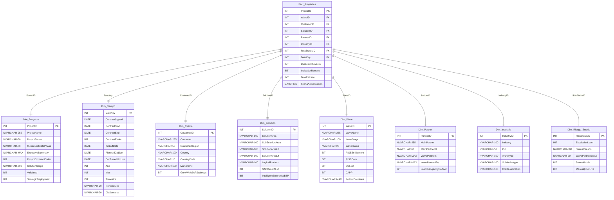

```mermaid
erDiagram
    Fact_Proyectos {
        INT ProjectID PK
        INT WaveID FK
        INT CustomerID FK
        INT SolutionID FK
        INT PartnerID FK
        INT IndustryID FK
        INT RiskStatusID FK
        INT DateKey FK
        INT DuracionProyecto
        BIT IndicadorRetraso
        INT DiasRetraso
        DATETIME FechaActualizacion
    }
    
    Dim_Proyecto {
        INT ProjectID PK
        NVARCHAR-255 ProjectName
        NVARCHAR-50 ProjectStatus
        NVARCHAR-50 CurrentActivatePhase
        NVARCHAR-MAX ExecutiveSummary
        BIT ProjectContractEnded
        NVARCHAR-500 SolutionScope
        BIT Validated
        BIT StrategicDeployment
    }
    
    Dim_Tiempo {
        INT DateKey PK
        DATE ContractSigned
        DATE ContractStart
        DATE ContractEnd
        BIT ContractEnded
        DATE KickoffDate
        DATE PlannedGoLive
        DATE ConfirmedGoLive
        INT Año
        INT Mes
        INT Trimestre
        NVARCHAR-20 NombreMes
        NVARCHAR-20 DiaSemana
    }
    
    Dim_Cliente {
        INT CustomerID PK
        NVARCHAR-255 Customer
        NVARCHAR-50 CustomerRegion
        NVARCHAR-100 Country
        NVARCHAR-10 CountryCode
        NVARCHAR-100 MarketUnit
        BIT GrowWithSAPScaleups
    }
    
    Dim_Solucion {
        INT SolutionID PK
        NVARCHAR-100 SolutionArea
        NVARCHAR-100 SubSolutionArea
        NVARCHAR-100 SolutionAreaL3
        NVARCHAR-100 SolutionAreaL4
        NVARCHAR-100 LogicalProduct
        BIT SAPCloudALM
        BIT IntelligentEnterpriseBTP
    }
    
    Dim_Wave {
        INT WaveID PK
        NVARCHAR-255 WaveName
        NVARCHAR-100 WaveStage
        NVARCHAR-20 WaveStatus
        BIT RISEEntitlement
        BIT RISECore
        BIT SOLEX
        BIT CAPP
        NVARCHAR-MAX RolloutCountries
    }
    
    Dim_Partner {
        INT PartnerID PK
        NVARCHAR-255 MainPartner
        NVARCHAR-50 MainPartnerID
        NVARCHAR-MAX WavePartners
        NVARCHAR-MAX WavePartnerIDs
        BIT LastChangedByPartner
    }
    
    Dim_Industria {
        INT IndustryID PK
        NVARCHAR-100 Industry
        NVARCHAR-50 ISS
        NVARCHAR-100 Archetype
        NVARCHAR-100 SubArchetype
        NVARCHAR-100 CSClassification
    }
    
    Dim_Riesgo_Estado {
        INT RiskStatusID PK
        INT EscalationLevel
        NVARCHAR-500 StatusReason
        NVARCHAR-20 WavePartnerStatus
        BIT StatusMatch
        BIT ManuallySetLive
    }

    %% Relaciones (Esquema de Estrella)
    Fact_Proyectos ||--|| Dim_Proyecto : "ProjectID"
    Fact_Proyectos ||--|| Dim_Tiempo : "DateKey"
    Fact_Proyectos ||--|| Dim_Cliente : "CustomerID"
    Fact_Proyectos ||--|| Dim_Solucion : "SolutionID"
    Fact_Proyectos ||--|| Dim_Wave : "WaveID"
    Fact_Proyectos ||--|| Dim_Partner : "PartnerID"
    Fact_Proyectos ||--|| Dim_Industria : "IndustryID"
    Fact_Proyectos ||--|| Dim_Riesgo_Estado : "RiskStatusID"
```
